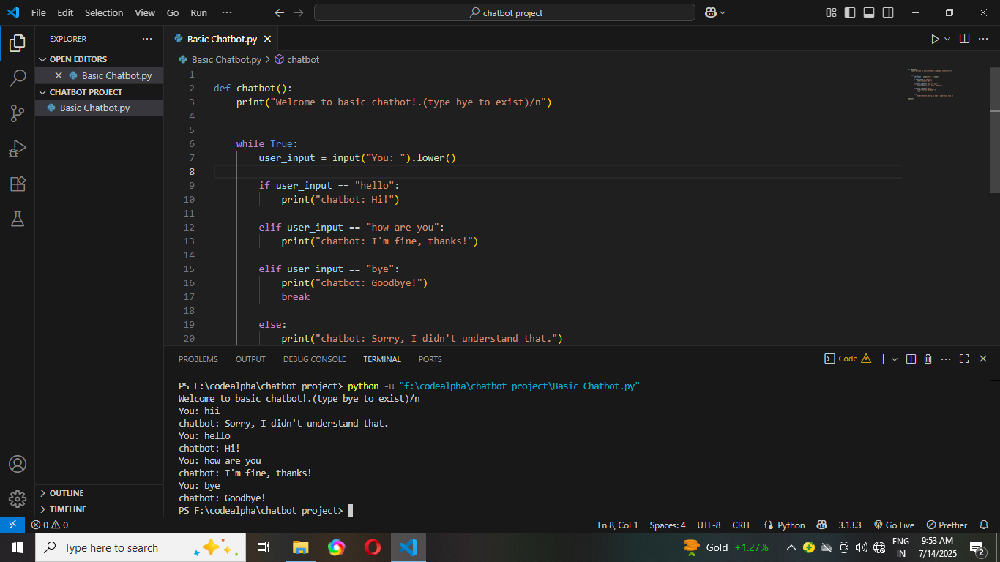

# 🤖 Chatbot - CodeAlpha Internship (Task 4)

This is a simple yet interactive command-line chatbot developed as **Task 4** of the [CodeAlpha Internship](https://codealpha.tech). The chatbot responds to basic user inputs and demonstrates fundamental Python programming and logic-building skills.

## 🚀 Features

- Greets user
- Responds to simple queries like "hello", "how are you","bye"
- Case-insensitive and input-friendly
- Clean and simple command-line interface

## 📸 Demo

